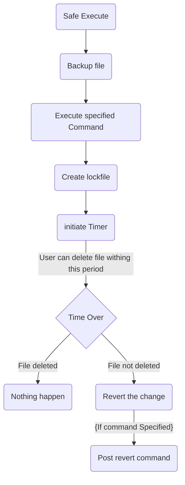

### Safe Change
CLI app to safely execute unsafe code (which might cause unaccessibility), by reverting changes if no response recieved.
### It work in following manner
1. It backups the to be modified file. (ie. conf files)
2. executes your command. (will change configuration)
3. create a lockfile (you'll been given it's path).
4. initiate a timer of specified timer(or default 30sec).
5. The lockfile need to be deleted within timeout.
6. If lockfile exists after timeout, the changes will revert.
7. On another case, nothing happens,(ie. your change applied).

#### Didn't understand??, try this


### Usage:
```text
Usage: safe_change [OPTION]... <command> <file_path> [post_revert_command]
CLI app to safely execute unsafe code (which might cause unaccessibility), by reverting changes if no response recieved.
Arguments
	-t, --timer <seconds>      Specify timer after to revert changes.
```

```sh
safe_change <command> # default timer 30 secs
```
```sh
safe_change <command> -t 10 # specifying 10 secs timer
```
